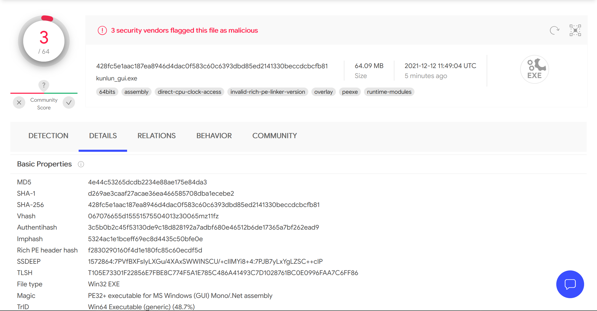
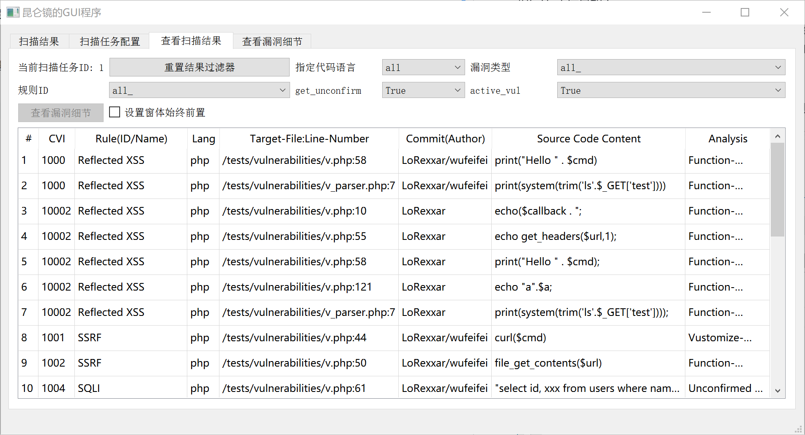
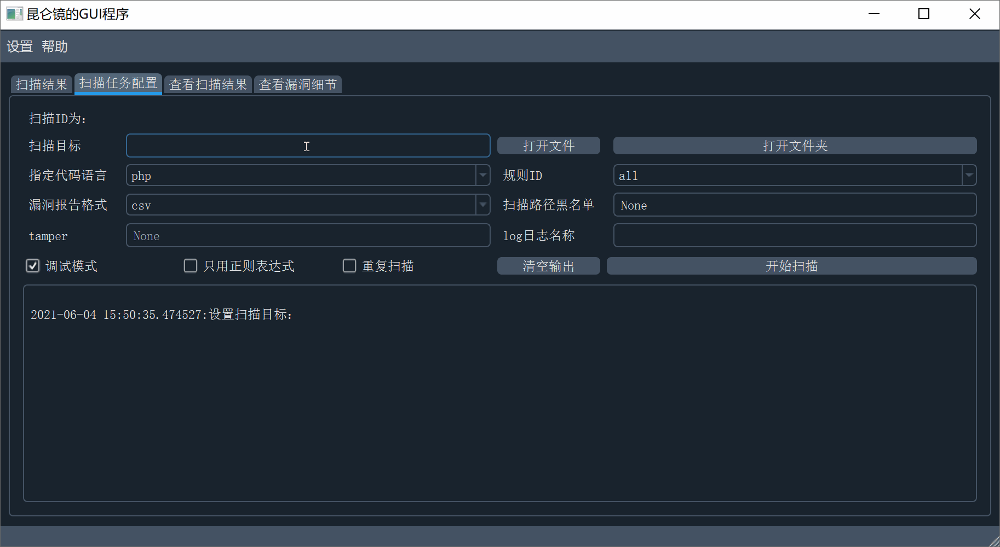
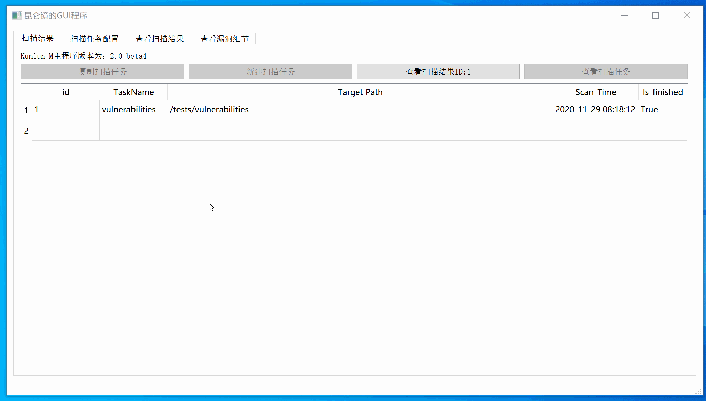

# Kunlun-M-GUI
[Kunlun-M](https://github.com/LoRexxar/Kunlun-M) 的 **非官方** GUI程序

**程序可以用来查看扫描的结果，但目前不能用来进行扫描。**

[点击我查看更新记录](./changelog.md)

## 使用前说明
**程序是闭源的，而且目前并不打算开源**。下图是VirusTotal的扫描结果，**请谨慎使用**。

https://www.virustotal.com/gui/file/428fc5e1aac187ea8946d4dac0f583c60c6393dbd85ed2141330beccdcbcfb81/detection



程序Hash信息如下:
``` bash
$ sha256sum kunlun_gui.exe
428fc5e1aac187ea8946d4dac0f583c60c6393dbd85ed2141330beccdcbcfb81  kunlun_gui.exe
```

## 使用说明
在 https://github.com/mark0smith/Kunlun-M-GUI/releases 下载 `kunlun_gui.exe`。
<del>，将其放在`kunlun.py`文件所在的<del>文件夹中运行即可。

点击程序图标即可运行，程序运行缓慢，请稍后。

界面如下：




## 使用演示


