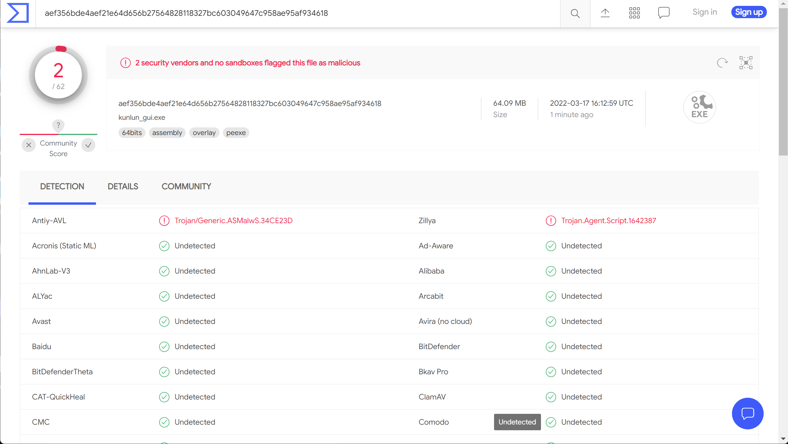

# Kunlun-M-GUI
[Kunlun-M](https://github.com/LoRexxar/Kunlun-M) 的 **非官方** GUI程序

**程序可以用来查看扫描的结果，但目前不能用来进行扫描。**

[点击我查看更新记录](./changelog.md)

## 使用前说明
**程序是闭源的，而且目前并不打算开源**。下图是VirusTotal的扫描结果，**请谨慎使用**。

https://www.virustotal.com/gui/file/e0237b73804f84f01bac8d806f72d0a4bc3f0e2d48114dfe6e6a37f22e88aeb7/detection



程序Hash信息如下:
``` bash
$ sha256sum kunlun_gui.exe
e0237b73804f84f01bac8d806f72d0a4bc3f0e2d48114dfe6e6a37f22e88aeb7  kunlun_gui.exe
```

## 使用说明
请先按照 https://github.com/LoRexxar/Kunlun-M 的说明，进行初始化的设置和扫描。

📢 同时，使用程序之前需要至少**运行一次** `python kunlun.py console` ；不然Rules数据库没初始化，程序会闪退。

在 https://github.com/mark0smith/Kunlun-M-GUI/releases 下载 `kunlun_gui.exe`
，将其放在`kunlun.py`文件所在的文件夹中。

点击程序图标即可运行，程序运行缓慢，请稍后。

界面如下：


## 使用演示
