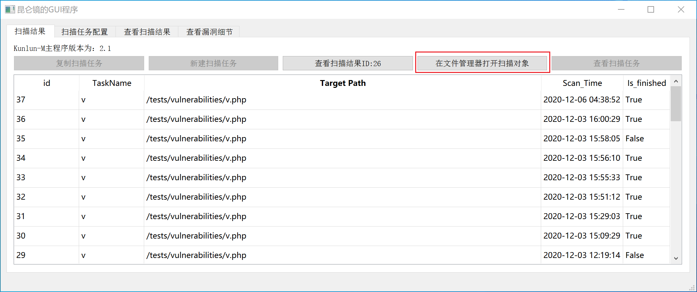
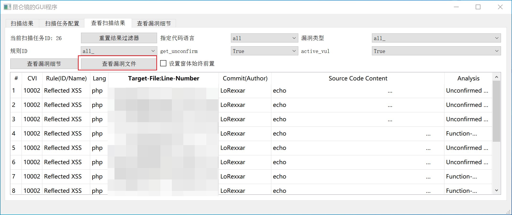
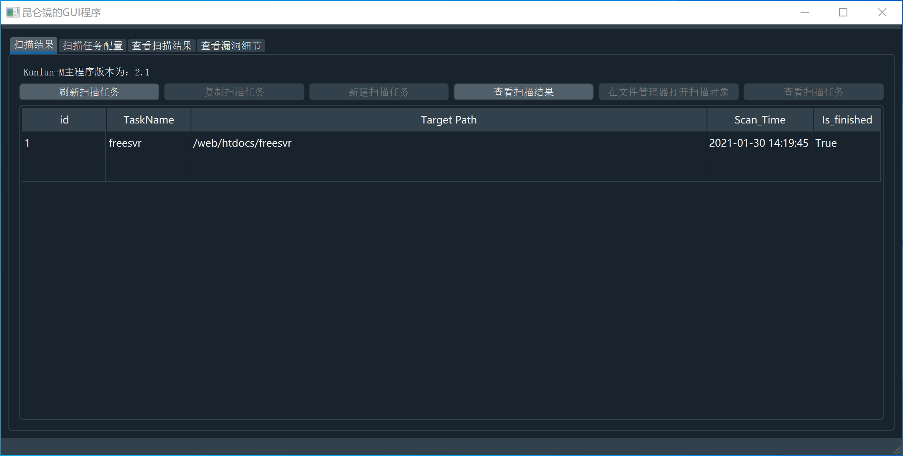
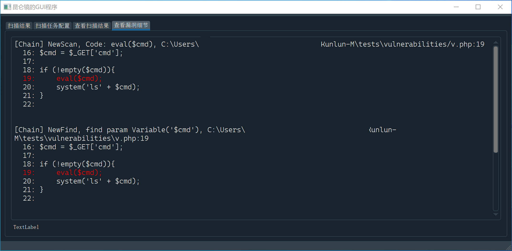
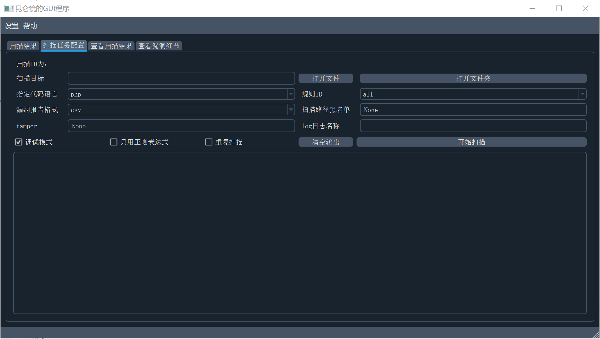
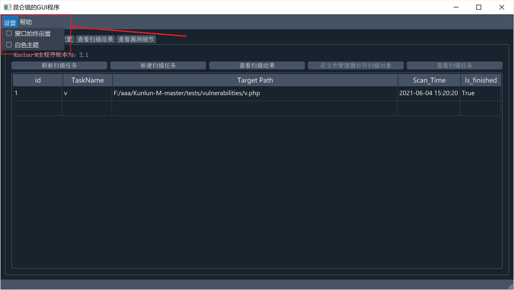

# 变更记录

## 2020-12-06 21:21:08
``` bash
$ sha256sum kunlun_gui.exe
fe6611713352a712bc3be189ecd73e9743054666dc8d46a427886aaa9d27d72d  kunlun_gui.exe
```

- 适配了[Kunlun-M](https://github.com/LoRexxar/Kunlun-M)的2.1版本
- 扫描任务界面增加了按钮，可以在文件管理器打开扫描目标

- 扫描结果界面增加了按钮，可以使用默认的文件管理器打开存在漏洞的文件



## 2021-01-31 23:26:45
``` bash
$ sha256sum kunlun_gui.exe
e0237b73804f84f01bac8d806f72d0a4bc3f0e2d48114dfe6e6a37f22e88aeb7  kunlun_gui.exe
```

- 默认采用黑色主题，更护眼😎

- `查看漏洞细节`Tab体验进行了优化，显示源代码，并高亮显示存在漏洞的行数。（虽然官方的console好早就支持了）🤣

- 修复了一个`打开扫描对象`和`查看漏洞文件`：若文件夹/文件不存在会闪退的bug


## 2021-06-04 15:24:14
``` bash
$ sha256sum kunlun_gui.exe
28f70050a8b2c70e8d34486ee266c2ac11999cc491cc562bf5fbc76a79c542b5  kunlun_gui.exe
```
- 实现了GUI界面的扫描

- 菜单栏增加了窗口前置、黑白主题的设置

- **增加了对初始环境的检测，能实现直接运行，不再依赖Kunlun-M文件夹**。

## 2021-12-12 19:40:27
``` bash
sha256sum kunlun_gui.exe
428fc5e1aac187ea8946d4dac0f583c60c6393dbd85ed2141330beccdcbcfb81  kunlun_gui.exe
```
- 适配了 KunLun-M 的 2.6.3 版本，只是适配了。🤣